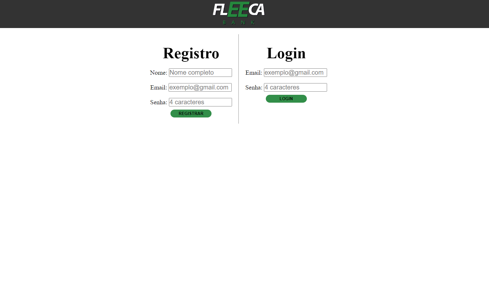

# E o Banco, hein?
Este é um pequeno projeto que simula um caixa eletrônico simples, criado usando HTML, CSS e JavaScript. Ele oferece funcionalidades básicas, incluindo saldo, extrato, depósito, saque e transferência.

## Funcionalidades
O projeto possui as seguintes funcionalidades:

* Saldo: Visualiza o saldo atual da sua conta.
* Extrato: Exibe o histórico de transações, incluindo depósitos, saques e transferências.
* Depósito: Permite que você deposite dinheiro em sua conta.
* Saque: Permite que você faça um saque da sua conta, desde que haja saldo disponível.
* Transferência: Realiza transferência, desde que haja saldo disponível.

## Deploy da aplicação
[Deploy feito pelo GitHub Pages]([https://moutim.github.io/Daily-Bugle-PROA/index.html](https://moutim.github.io/eOBancoEm/index.html)https://moutim.github.io/eOBancoEm/index.html)

